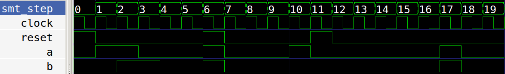

# SVA

SVA is an assertion language for System Verilog. SVA is supported by the Verific
front end of sby.

SVA makes it easier and cleaner to assert or cover seqeuences of signal patterns
in your designs.

The subset of SVA supported in sby is defined [here](https://symbiyosys.readthedocs.io/en/latest/verific.html)

## Demos

In all these demos, we are making use of default clocking, so the properties by default
all get attached to the clock.

	default clocking @(posedge clock); endclocking

In addition, the assertions are disabled if reset is ever high.

	default disable iff (reset);

To run the demos, type this:

    sby -f demo_01_impl.sv

And to view the trace:

    gtkwave demo_01_impl/engine_0/trace.vcd demo_01_impl.gtkw

## Demo 1: Implication

|-> and |=> are called implication operators: 

    Antecedent |-> Consequent

If the antecedent is followed by |-> then the consequent must happen in the same cycle.
If the antecedent is followed by |=> then the consequent must happen in the next cycle.

In the demo we use this expression:

    // in the cycle after a, b must be high
	assert property (a |=> b);

And it fails at step 18 because b is not high after a. At steps 6 and 11 we don't care
because reset is high.

## Demo 2: Delay

## Demo 3: Consecutive

## Demo 4: Throughout
