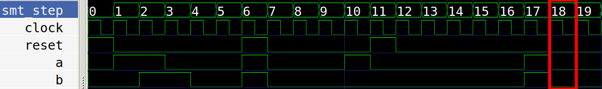

# SVA

SVA is an assertion language for System Verilog. SVA is supported by the Verific
front end of sby.

SVA makes it easier and cleaner to assert or cover seqeuences of signal patterns
in your designs.

The subset of SVA supported in sby is defined [here](https://symbiyosys.readthedocs.io/en/latest/verific.html)

We have also made a video that covers this topic - which you can watch here https://www.youtube.com/watch?v=1lCLWRDm92w

## Demos

In all these demos, we are making use of default clocking, so the properties by default
all get attached to the clock.

	default clocking @(posedge clock); endclocking

In addition, the assertions are disabled if reset is ever high.

	default disable iff (reset);

To run demo 1, type this:

    sby -f demo_01_impl.sv

You will see the step that the assertion fails for each example is 1 higher than in the explanations below
because on a clocked assertion, the failure is reported on the subsequent cycle.

To view the counter example trace for demo 1:

    gtkwave demo_01_impl/engine_0/trace.vcd demo_01_impl.gtkw
    
After checking a demo, look at the .sv file - you can easily change the sequence of signals and check the 
assertions work as you expect.

## Demo 1: Implication

|-> and |=> are called implication operators: 

    Antecedent |-> Consequent

If the antecedent is followed by |-> then the consequent must happen in the same cycle.
If the antecedent is followed by |=> then the consequent must happen in the next cycle.

In the [demo](demo_01_impl.sv) we use this expression:

    // in the cycle after a, b must be high
	assert property (a |=> b);

The assertion fails at step 18 because b is not high after a. 
At steps 6 and 11 the assertion is disabled due to reset being high.

## Demo 2: Delay

A delay can be given like ##1 or ##2 to delay 1 or 2 cycles respectively.
A delay range can be given like ##[1:2] to mean between 1 and 2 cycles.

In the [demo](demo_02_delay.sv) we use this expression:

    // in any cycle when a is high, b must be high 1 to 2 cycles later
	assert property (a |-> ##[1:2] b);

The assertion fails at step 16 because b is not high between 1 and 2 cycles after a. 
At step 6 the assertion is disabled due to reset being high.

## Demo 3: Consecutive

Here we show how to specify that a signal should remain high for a consecutive number of cycles.
The sequence of 2 cycles of b is defined by b[*2].

In the [demo](demo_03_consecutive.sv) we use this expression:

    // after a goes high, b must be high for 2 cycles followed 1 cycle later by c
	assert property ($rose(a) |=> b[*2] ##1 c);

The assertion fails at step 15 because b is not high after a goes high.
At step 8 the assertion is disabled due to reset being high.

## Demo 4: Throughout and Go To repetition.

Throughout allows us to specify that a sequence should happen throughout another sequence.
We also introduce Go To repetition [->X]. For example c[->3] means we need 3 non necessarily 
consecutive cycles of c.

In the [demo](demo_04_throughout.sv) we use this expression:

    // after a goes high, b must be high throughout 3 (not necessarily consecutive) cycles of c
	assert property ($rose(a) |=> (b throughout c[->3]));

The assertion fails at step 16 because b does not remain high while we wait for 3 cycles of c.
At step 9 the assertion is disabled due to reset being high.

# Other Resources

* Tudor Timi's Symbiotic EDA webinar presentation on SVA: https://github.com/verification-gentleman-blog/getting-started-with-sva
* Peter Monsson's SVA cheat sheet: http://peter.monsson.dk/2015/11/16/a-systemverilog-assertions-checklist-and-cheat-sheet/
* Some examples inspired by https://www.design-reuse.com/articles/44987/system-verilog-assertions-simplified.html
